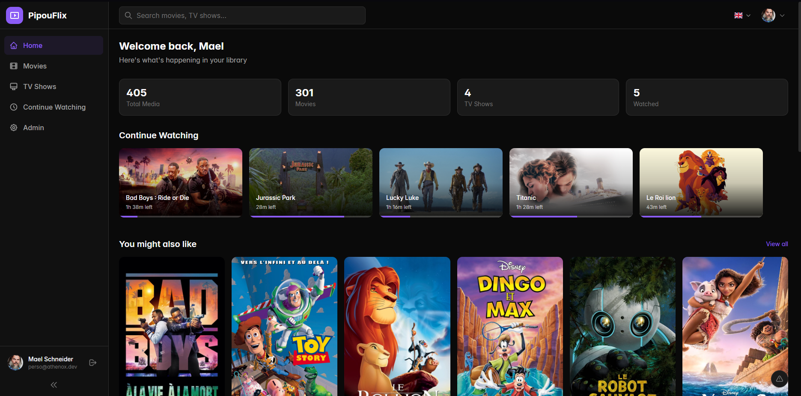
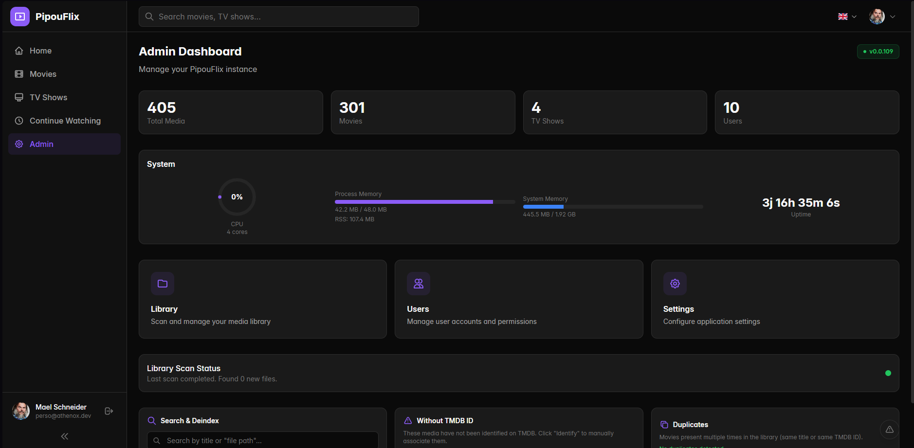
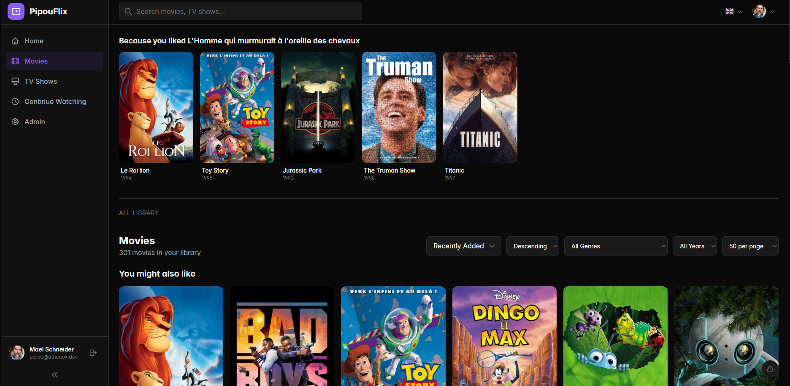
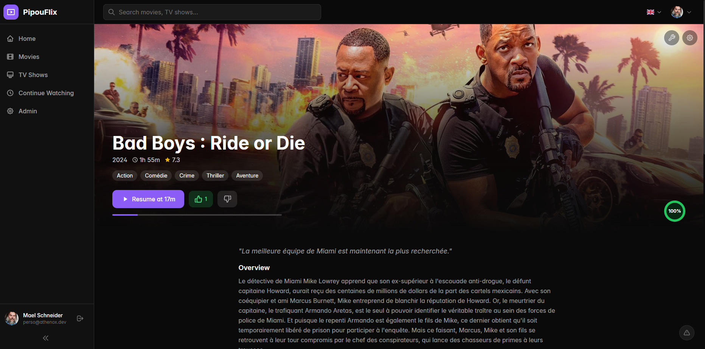
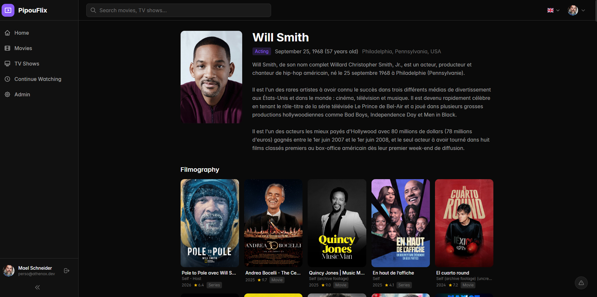

# LumiR

LumiR is a self-hosted media platform focused on a polished personal library experience: local scan, clean playback, multi-user profiles, admin tooling, setup wizard, updates, and a plugin system for optional features.

LumiR is built to be simple to install, pleasant to use every day, and easy to extend without polluting the core with optional capabilities.

Partner hosting: [OxalisHeberg.fr](https://oxalisheberg.fr) supports LumiR deployment on a VPS and can provide a 1-click install on any offer.

Support the project: [GitHub Sponsors](https://github.com/sponsors/Athenox14)

## Why LumiR

- Clean interface for a personal movie and TV library
- First-launch setup wizard for the initial admin account
- Automatic library scan and TMDB metadata enrichment
- FFmpeg-powered playback pipeline
- Multi-user accounts with watch progress
- Admin area for library, users, settings, plugins, analytics, announcements, and updates
- Plugin architecture for optional features that should stay outside the core

## Screenshots

**Accueil**

- The main dashboard blends quick library stats, continue-watching shortcuts, recommendations, and recently added titles in a single view. It is designed to feel like the daily entry point rather than just a plain file index.



**Dashboard admin**

- The admin home aggregates platform stats, system health, scan state, update status, loaded plugins, and moderation or cleanup tools such as duplicate detection and missing-TMDB checks.



**Bibliothèque**

- The movie library page combines personalized rows with classic filters for sorting, genre, year, and page size, so the interface works both as a discovery surface and as a practical collection browser.



**Fiche film**

- Each media page mixes cinematic presentation with useful metadata: backdrop hero, resume state, likes and dislikes, overview, cast, technical tracks, franchise links, and local recommendations.



**Lecteur**

- Playback runs in a dedicated fullscreen layout with resume support, progress tracking, audio-track switching, subtitle selection, and automatic next-episode behavior for TV content.


**Profil public**

- User profile pages can expose a public-facing identity with avatar or favorite actor, viewing stats, liked titles, and watched titles, while still respecting profile privacy settings.



## Features

- **Local library first**: scan folders, identify media, enrich posters, backdrops, ratings, cast, and metadata from TMDB.
- **Smooth playback**: LumiR uses FFmpeg and HLS-friendly streaming flows to keep playback reliable across devices.
- **Multi-user**: role-based accounts, watch progress, profile pages, and admin controls.
- **Setup wizard**: the first launch guides the instance setup instead of throwing raw config at the user.
- **Automatic updates**: admin-controlled update checks with unattended install when the instance is idle.
- **Plugin system**: optional features can live in isolated plugins with their own pages, navigation, settings, i18n, and server router.
- **Admin tooling**: users, library management, plugin management, bug reports, announcements, analytics, and system settings in one place.

## Installation

### Quick install

If you use `install.sh`, LumiR prepares the runtime environment for you:

- downloads the latest public release
- installs the built app
- generates `.env`
- generates `NUXT_SESSION_PASSWORD`
- sets `DATABASE_PATH=./data/lumir.db`
- creates and starts the systemd service
- can mount an SMB share for your media library

```bash
sudo bash install.sh
```

Example with SMB:

```bash
sudo bash install.sh \
  --port 3000 \
  --smb //192.168.1.100/Media \
  --smb-user myuser \
  --smb-pass mypassword
```

### Manual install

Prerequisites:

- Node.js 22+
- FFmpeg installed on the host
- a TMDB API key for metadata features

```bash
git clone https://github.com/Athenox14/LumiR.git
cd LumiR
npm install
```

Create a minimal `.env`:

```env
NUXT_SESSION_PASSWORD=a_random_32char_secret
```

Then run:

```bash
# Development
npm run dev

# Production build
npm run build
node .output/server/index.mjs
```

At first launch, LumiR opens a setup wizard so the admin account and core instance settings can be configured from the UI.

## Plugins

The core repo only keeps a minimal example plugin.

Real plugins are loaded from two locations:

- `plugins/example` for the versioned example plugin
- `../lumir-plugins/*` by default for local, non-versioned plugins

You can override the external directory with `LUMIR_PLUGINS_DIR=/absolute/path/to/your/plugins`.

Each plugin can provide:

- sidebar entries
- routed pages under `/p/<plugin-id>/...`
- plugin settings fields
- plugin i18n messages
- plugin server routers

The goal is to keep optional features outside the core. The core should only handle discovery, mounting, permissions, and shared infrastructure.

That also means optional provider stacks, scrapers, extractors, and any legally sensitive integrations should live in external plugins rather than in this repository.

### Keeping plugins out of Git

If you already have a local plugin inside the repo and want to keep it locally while removing it from future commits:

```bash
mkdir -p ../lumir-plugins
mv plugins/remote-media ../lumir-plugins/remote-media
git rm -r --cached plugins/remote-media
```

On Windows PowerShell:

```powershell
New-Item -ItemType Directory -Force ..\lumir-plugins
Move-Item plugins\remote-media ..\lumir-plugins\remote-media
git rm -r --cached plugins/remote-media
```

After that, restart the dev server or rebuild the app so Nuxt reloads the plugin graph.

## Tech stack

| Layer | Technology |
|---|---|
| Full-stack framework | Nuxt 4 + Nitro |
| Frontend | Vue 3, Tailwind CSS, Vidstack |
| API | tRPC |
| Database | SQLite with Drizzle ORM |
| Media processing | FFmpeg |
| Metadata | TMDB API |

## Project structure

```text
app/          # Frontend app
server/       # Core server, API, DB, shared runtime utilities
plugins/      # Example plugin kept in the repo
docs/images/  # README screenshots
```

## Roadmap

- Fix the public profile page so it shows the correct data
- Add a proper watchlist
- Improve the translation system
- Add more languages

## License

MIT
